# Coronary Artery Segmentation using Fine-tuned SAM2

This project provides a Gradio interface for segmenting coronary arteries in X-ray images using fine-tuned Segment Anything Model 2 (SAM2) variants.

---

## 🚀 Live Demo

Try out the Coronary Artery Segmentation tool online:  
👉 [Hugging Face Space (Gradio Demo)](https://huggingface.co/spaces/astroanand/CoronarySAM2_FT)

---

## 🧩 Fine-Tuned Models

All fine-tuned SAM2 model checkpoints are available at:  
👉 [Hugging Face: astroanand/CoronarySAM2](https://huggingface.co/astroanand/CoronarySAM2)

---

## Workflow Diagram

The following diagram illustrates the workflow of the coronary artery segmentation process using the fine-tuned SAM2 model:



The workflow consists of several key stages:
1. Image preprocessing (normalization, enhancement)
2. User interaction through point prompts
3. Processing by fine-tuned SAM2 components
4. Generation of the final segmentation mask

## Setup

### 1. Create Conda Environment

It is recommended to use a Conda environment to manage dependencies.

```bash
# Create a new conda environment named sam2_FT_env with Python 3.10
conda create -n sam2_FT_env python=3.10.0 -y

# Activate the environment
conda activate sam2_FT_env
```

### 2. Install SAM2 Library

You need to install the `segment-anything-2` library. You can do this in two ways:

**Method A: Clone and Install (Recommended for development)**

```bash
# Clone the official repository
git clone https://github.com/facebookresearch/segment-anything-2.git

# Change directory
cd segment-anything-2

# Install the package in editable mode
pip install -e .

# Change back to the project directory
cd ..
```

**Method B: Direct Pip Install**

If you don't need to modify the SAM2 library code, you can install it directly using pip:

```bash
pip install sam2
```

### 3. Install Other Dependencies

Install Gradio and OpenCV if you haven't already:

```bash
pip install gradio opencv-python-headless torch torchvision torchaudio --index-url https://download.pytorch.org/whl/cu118 # Adjust CUDA version if needed
```
*(Note: Ensure you install the correct PyTorch version for your CUDA setup if using GPU)*

## Running the Application

1.  **Ensure Models are Present:** Make sure the fine-tuned model checkpoints (`.pt` files) are located in the paths specified in `app.py` (e.g., `fine_tuned_sam2_hiera_t/best_model.pt`).  
    - You can [download the latest fine-tuned models here](https://huggingface.co/astroanand/CoronarySAM2).
2.  **Activate Environment:** `conda activate sam2_FT_env`
3.  **Run the App:** `python app.py`
4.  Open the provided URL (usually `http://127.0.0.1:7860`) in your web browser.

## Optional: Download Pre-trained SAM2 Checkpoints

If you want to use the original pre-trained SAM2 checkpoints (not the fine-tuned ones used by default in this app), you can download them using `wget`:

```bash
# !wget -O sam2_hiera_tiny.pt "https://dl.fbaipublicfiles.com/segment_anything_2/072824/sam2_hiera_tiny.pt"
# !wget -O sam2_hiera_small.pt "https://dl.fbaipublicfiles.com/segment_anything_2/072824/sam2_hiera_small.pt"
# !wget -O sam2_hiera_base_plus.pt "https://dl.fbaipublicfiles.com/segment_anything_2/072824/sam2_hiera_base_plus.pt"
# !wget -O sam2_hiera_large.pt "https://dl.fbaipublicfiles.com/segment_anything_2/072824/sam2_hiera_large.pt"
```
*(Uncomment the lines for the models you wish to download)*
